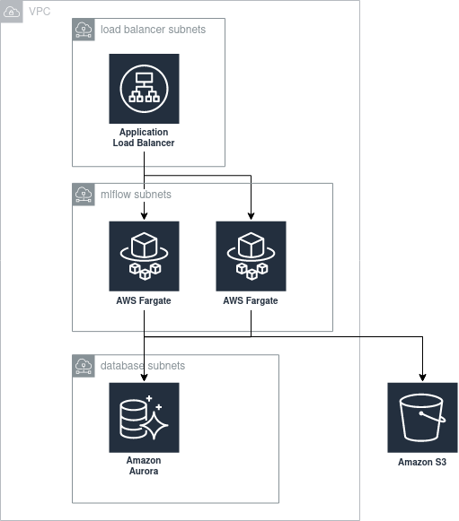

<!--  This is the README.md template for the `terraform-module.gotmpl` repository  --><a href="https://humn.ai/">
<picture align="center">
  <source align="center" media="(prefers-color-scheme: dark)" srcset="https://humnai-web-assests.s3.eu-west-1.amazonaws.com/humn-logo-light-small.png">
  <source align="center" media="(prefers-color-scheme: light)" srcset="https://humnai-web-assests.s3-eu-west-1.amazonaws.com/humn-logo-dark-small.png">
  
</picture>
</a>
<br/>


# tf-mod-aws-mlflow


## 👋 Introduction
This terraform module allows you to deploy a cluster of MLflow servers + UI using:

- ECS Fargate as the compute engine
- Amazon Aurora Serverless as the backend store
- S3 as the default artifact root

## 👨‍🎨 Design principles

  When designing this module, we've made some decisions about technologies and configuration that might not apply to all use cases. In doing so, we've applied the following principles, in this order:

  - __High availability and recovery__. All components are meant to be highly available and provide backups so that important data can be recovered in case of a failure. Database back-ups are activated, and versioning is enabled for the S3 bucket.
  - __Least privilege__. We've created dedicated security groups and IAM roles, and restricted traffic/permissions to the minimum necessary to run MLflow.
  - __Smallest maintenance overhead__. We've chosen serverless technologies like Fargate and Aurora Serverless to minimize the cost of ownership of an MLflow cluster.
  - __Smallest cost overhead__. We've tried to choose technologies that minimize costs, under the assumption that MLflow will be an internal tool that is used during working hours, and with a very lightweight use of the database.
  - __Private by default__. As of version 1.9.1, MLflow doesn't provide native authentication/authorization mechanisms. When using the default values, the module will create resources that are not exposed to the Internet. Moreover, the module provides server-side encryption for the S3 bucket and the database through different KMS keys.
  - __Flexibility__. Where possible, we've tried to make this module usable under different circumstances. For instance, you can use it to deploy MLflow to a private VPN and access it within a VPN, or you can leverage ALB's integration with Cognito/OIDC to allow users to access MLflow from your SSO solution.

  ## 🏗️ Architecture

  The following diagram illustrates the components the module creates with the default configuration:

  


## 🔨 Usage


To use this module, you can simply:

```hcl
module "mlflow" {
  source  = "glovo/mlflow/aws"
  version = "1.0.0"

  unique_name                       = "mlflow-team-x"
  vpc_id                            = "my-vpc"
  load_balancer_subnet_ids          = ["public-subnet-az-1", "public-subnet-az-2", "public-subnet-az-3"]
  load_balancer_ingress_cidr_blocks = ["192.0.2.0/24"]
  service_subnet_ids                = ["private-subnet-az-1", "private-subnet-az-2", "private-subnet-az-3"]
  database_subnet_ids               = ["db-private-subnet-az-1", "db-private-subnet-az-2", "db-private-subnet-az-3"]
  database_password_secret_arn      = "mlflow-team-x-db-password-arn"
}
```

You can find a more complete usage example in [`terratest/examples/main.tf`](terratest/examples/main.tf).

Note you may also:

- Add sidecar containers (e.g. a [datadog agent for Fargate](https://www.datadoghq.com/blog/monitor-aws-fargate/))
- Provide your own bucket/path as the default artifact root
- Attach an autoscaling policy to the service (for instance, you may scale down to 0 instances during the night)


<!-- BEGIN_TF_DOCS -->
## Requirements

No requirements.

## Providers

| Name | Version |
|------|---------|
| <a name="provider_aws"></a> [aws](#provider\_aws) | n/a |

## Modules

No modules.

## Resources

| Name | Type |
|------|------|
| [aws_apigatewayv2_api.mlflow](https://registry.terraform.io/providers/hashicorp/aws/latest/docs/resources/apigatewayv2_api) | resource |
| [aws_apigatewayv2_api_mapping.mlflow](https://registry.terraform.io/providers/hashicorp/aws/latest/docs/resources/apigatewayv2_api_mapping) | resource |
| [aws_apigatewayv2_authorizer.lambda](https://registry.terraform.io/providers/hashicorp/aws/latest/docs/resources/apigatewayv2_authorizer) | resource |
| [aws_apigatewayv2_domain_name.mlflow](https://registry.terraform.io/providers/hashicorp/aws/latest/docs/resources/apigatewayv2_domain_name) | resource |
| [aws_apigatewayv2_integration.mlflow](https://registry.terraform.io/providers/hashicorp/aws/latest/docs/resources/apigatewayv2_integration) | resource |
| [aws_apigatewayv2_route.default](https://registry.terraform.io/providers/hashicorp/aws/latest/docs/resources/apigatewayv2_route) | resource |
| [aws_apigatewayv2_stage.default](https://registry.terraform.io/providers/hashicorp/aws/latest/docs/resources/apigatewayv2_stage) | resource |
| [aws_apigatewayv2_vpc_link.mlflow](https://registry.terraform.io/providers/hashicorp/aws/latest/docs/resources/apigatewayv2_vpc_link) | resource |
| [aws_appautoscaling_target.mlflow](https://registry.terraform.io/providers/hashicorp/aws/latest/docs/resources/appautoscaling_target) | resource |
| [aws_cloudwatch_log_group.mlflow](https://registry.terraform.io/providers/hashicorp/aws/latest/docs/resources/cloudwatch_log_group) | resource |
| [aws_db_subnet_group.rds](https://registry.terraform.io/providers/hashicorp/aws/latest/docs/resources/db_subnet_group) | resource |
| [aws_ecs_cluster.mlflow](https://registry.terraform.io/providers/hashicorp/aws/latest/docs/resources/ecs_cluster) | resource |
| [aws_ecs_service.mlflow](https://registry.terraform.io/providers/hashicorp/aws/latest/docs/resources/ecs_service) | resource |
| [aws_ecs_task_definition.mlflow](https://registry.terraform.io/providers/hashicorp/aws/latest/docs/resources/ecs_task_definition) | resource |
| [aws_iam_role.ecs_execution](https://registry.terraform.io/providers/hashicorp/aws/latest/docs/resources/iam_role) | resource |
| [aws_iam_role.ecs_task](https://registry.terraform.io/providers/hashicorp/aws/latest/docs/resources/iam_role) | resource |
| [aws_iam_role.lambda](https://registry.terraform.io/providers/hashicorp/aws/latest/docs/resources/iam_role) | resource |
| [aws_iam_role_policy.db_secrets](https://registry.terraform.io/providers/hashicorp/aws/latest/docs/resources/iam_role_policy) | resource |
| [aws_iam_role_policy.default_bucket](https://registry.terraform.io/providers/hashicorp/aws/latest/docs/resources/iam_role_policy) | resource |
| [aws_iam_role_policy_attachment.ecs_execution](https://registry.terraform.io/providers/hashicorp/aws/latest/docs/resources/iam_role_policy_attachment) | resource |
| [aws_iam_role_policy_attachment.lambda](https://registry.terraform.io/providers/hashicorp/aws/latest/docs/resources/iam_role_policy_attachment) | resource |
| [aws_lambda_function.mlflow](https://registry.terraform.io/providers/hashicorp/aws/latest/docs/resources/lambda_function) | resource |
| [aws_lb.mlflow](https://registry.terraform.io/providers/hashicorp/aws/latest/docs/resources/lb) | resource |
| [aws_lb_listener.http](https://registry.terraform.io/providers/hashicorp/aws/latest/docs/resources/lb_listener) | resource |
| [aws_lb_listener.https](https://registry.terraform.io/providers/hashicorp/aws/latest/docs/resources/lb_listener) | resource |
| [aws_lb_listener_rule.api](https://registry.terraform.io/providers/hashicorp/aws/latest/docs/resources/lb_listener_rule) | resource |
| [aws_lb_listener_rule.http](https://registry.terraform.io/providers/hashicorp/aws/latest/docs/resources/lb_listener_rule) | resource |
| [aws_lb_listener_rule.https](https://registry.terraform.io/providers/hashicorp/aws/latest/docs/resources/lb_listener_rule) | resource |
| [aws_lb_target_group.mlflow](https://registry.terraform.io/providers/hashicorp/aws/latest/docs/resources/lb_target_group) | resource |
| [aws_rds_cluster.backend_store](https://registry.terraform.io/providers/hashicorp/aws/latest/docs/resources/rds_cluster) | resource |
| [aws_route53_record.api](https://registry.terraform.io/providers/hashicorp/aws/latest/docs/resources/route53_record) | resource |
| [aws_route53_record.record](https://registry.terraform.io/providers/hashicorp/aws/latest/docs/resources/route53_record) | resource |
| [aws_s3_bucket.default](https://registry.terraform.io/providers/hashicorp/aws/latest/docs/resources/s3_bucket) | resource |
| [aws_security_group.ecs_service](https://registry.terraform.io/providers/hashicorp/aws/latest/docs/resources/security_group) | resource |
| [aws_security_group.lb](https://registry.terraform.io/providers/hashicorp/aws/latest/docs/resources/security_group) | resource |
| [aws_security_group.rds](https://registry.terraform.io/providers/hashicorp/aws/latest/docs/resources/security_group) | resource |
| [aws_security_group_rule.lb_egress](https://registry.terraform.io/providers/hashicorp/aws/latest/docs/resources/security_group_rule) | resource |
| [aws_security_group_rule.lb_egress_idp](https://registry.terraform.io/providers/hashicorp/aws/latest/docs/resources/security_group_rule) | resource |
| [aws_security_group_rule.lb_ingress_http](https://registry.terraform.io/providers/hashicorp/aws/latest/docs/resources/security_group_rule) | resource |
| [aws_security_group_rule.lb_ingress_https](https://registry.terraform.io/providers/hashicorp/aws/latest/docs/resources/security_group_rule) | resource |
| [aws_availability_zones.available](https://registry.terraform.io/providers/hashicorp/aws/latest/docs/data-sources/availability_zones) | data source |
| [aws_region.current](https://registry.terraform.io/providers/hashicorp/aws/latest/docs/data-sources/region) | data source |
| [aws_secretsmanager_secret.db_password](https://registry.terraform.io/providers/hashicorp/aws/latest/docs/data-sources/secretsmanager_secret) | data source |
| [aws_secretsmanager_secret_version.db_password](https://registry.terraform.io/providers/hashicorp/aws/latest/docs/data-sources/secretsmanager_secret_version) | data source |

## Inputs

| Name | Description | Type | Default | Required |
|------|-------------|------|---------|:--------:|
| <a name="input_api_cert_arn"></a> [api\_cert\_arn](#input\_api\_cert\_arn) | (Required) - The ARN of AMC for api dns zone | `string` | n/a | yes |
| <a name="input_api_zone_id"></a> [api\_zone\_id](#input\_api\_zone\_id) | (Required) - The ID of the hosted zone MlFlow api access will be hosted at. | `string` | n/a | yes |
| <a name="input_api_zone_name"></a> [api\_zone\_name](#input\_api\_zone\_name) | (Required) - The name of the hosted zone MlFlow api access will be hosted at. | `string` | n/a | yes |
| <a name="input_artifact_bucket_encryption_algorithm"></a> [artifact\_bucket\_encryption\_algorithm](#input\_artifact\_bucket\_encryption\_algorithm) | Algorithm used for encrypting the default bucket. | `string` | `"AES256"` | no |
| <a name="input_artifact_bucket_encryption_key_arn"></a> [artifact\_bucket\_encryption\_key\_arn](#input\_artifact\_bucket\_encryption\_key\_arn) | ARN of the key used to encrypt the bucket. Only needed if you set aws:kms as encryption algorithm. | `string` | `null` | no |
| <a name="input_artifact_bucket_id"></a> [artifact\_bucket\_id](#input\_artifact\_bucket\_id) | If specified, MLflow will use this bucket to store artifacts. Otherwise, this module will create a dedicated bucket. When overriding this value, you need to enable the task role to access the root you specified | `string` | `null` | no |
| <a name="input_artifact_bucket_path"></a> [artifact\_bucket\_path](#input\_artifact\_bucket\_path) | The path within the bucket where MLflow will store its artifacts | `string` | `"/"` | no |
| <a name="input_artifact_buckets_mlflow_will_read"></a> [artifact\_buckets\_mlflow\_will\_read](#input\_artifact\_buckets\_mlflow\_will\_read) | A list of bucket IDs MLflow will need read access to, in order to show the stored artifacts. It accepts any valid IAM resource, including ARNs with wildcards, so you can do something like arn:aws:s3:::bucket-prefix-* | `list(string)` | `[]` | no |
| <a name="input_aws_account_id"></a> [aws\_account\_id](#input\_aws\_account\_id) | The AWS account id of the provider being deployed to (e.g. 12345678). Autoloaded from account.tfvars | `string` | `""` | no |
| <a name="input_aws_assume_role_arn"></a> [aws\_assume\_role\_arn](#input\_aws\_assume\_role\_arn) | (Optional) - ARN of the IAM role when optionally connecting to AWS via assumed role. Autoloaded from account.tfvars. | `string` | `""` | no |
| <a name="input_aws_cognito_user_pool_arn"></a> [aws\_cognito\_user\_pool\_arn](#input\_aws\_cognito\_user\_pool\_arn) | (Required) - AWS Cognito user pool arn | `string` | n/a | yes |
| <a name="input_aws_cognito_user_pool_client_id"></a> [aws\_cognito\_user\_pool\_client\_id](#input\_aws\_cognito\_user\_pool\_client\_id) | (Required) - AWS Cognito user pool client id | `string` | n/a | yes |
| <a name="input_aws_cognito_user_pool_domain"></a> [aws\_cognito\_user\_pool\_domain](#input\_aws\_cognito\_user\_pool\_domain) | (Required) - AWS Cognito user pool domain | `string` | n/a | yes |
| <a name="input_aws_region"></a> [aws\_region](#input\_aws\_region) | The AWS region (e.g. ap-southeast-2). Autoloaded from region.tfvars. | `string` | `""` | no |
| <a name="input_certificate_arn"></a> [certificate\_arn](#input\_certificate\_arn) | (Required) - The ARN of the certificate MlFlow traffic will be encrypted with. | `string` | n/a | yes |
| <a name="input_database_auto_pause"></a> [database\_auto\_pause](#input\_database\_auto\_pause) | Pause Aurora Serverless after a given amount of time with no activity. https://docs.aws.amazon.com/AmazonRDS/latest/AuroraUserGuide/aurora-serverless.how-it-works.html#aurora-serverless.how-it-works.pause-resume | `bool` | `true` | no |
| <a name="input_database_max_capacity"></a> [database\_max\_capacity](#input\_database\_max\_capacity) | The maximum capacity for the Aurora Serverless cluster. Aurora will scale automatically in this range. See: https://docs.aws.amazon.com/AmazonRDS/latest/AuroraUserGuide/aurora-serverless.how-it-works.html | `number` | `1` | no |
| <a name="input_database_min_capacity"></a> [database\_min\_capacity](#input\_database\_min\_capacity) | The minimum capacity for the Aurora Serverless cluster. Aurora will scale automatically in this range. See: https://docs.aws.amazon.com/AmazonRDS/latest/AuroraUserGuide/aurora-serverless.how-it-works.html | `number` | `1` | no |
| <a name="input_database_password_secret_arn"></a> [database\_password\_secret\_arn](#input\_database\_password\_secret\_arn) | The ARN of the SecretManager secret that defines the database password. It needs to be created before calling the module | `string` | n/a | yes |
| <a name="input_database_seconds_until_auto_pause"></a> [database\_seconds\_until\_auto\_pause](#input\_database\_seconds\_until\_auto\_pause) | The number of seconds without activity before Aurora Serverless is paused. https://docs.aws.amazon.com/AmazonRDS/latest/AuroraUserGuide/aurora-serverless.how-it-works.html#aurora-serverless.how-it-works.pause-resume | `number` | `300` | no |
| <a name="input_database_skip_final_snapshot"></a> [database\_skip\_final\_snapshot](#input\_database\_skip\_final\_snapshot) | n/a | `bool` | `false` | no |
| <a name="input_database_subnet_ids"></a> [database\_subnet\_ids](#input\_database\_subnet\_ids) | List of subnets where the RDS database will be deployed | `list(string)` | n/a | yes |
| <a name="input_gunicorn_opts"></a> [gunicorn\_opts](#input\_gunicorn\_opts) | Additional command line options forwarded to gunicorn processes (https://mlflow.org/docs/latest/cli.html#cmdoption-mlflow-server-gunicorn-opts) | `string` | `""` | no |
| <a name="input_key_arn"></a> [key\_arn](#input\_key\_arn) | (Required) - The KMS key used to encrypt the secrets. | `string` | n/a | yes |
| <a name="input_load_balancer_ingress_cidr_blocks"></a> [load\_balancer\_ingress\_cidr\_blocks](#input\_load\_balancer\_ingress\_cidr\_blocks) | CIDR blocks from where to allow traffic to the Load Balancer. With an internal LB, we've left this | `list(string)` | n/a | yes |
| <a name="input_load_balancer_is_internal"></a> [load\_balancer\_is\_internal](#input\_load\_balancer\_is\_internal) | By default, the load balancer is internal. This is because as of v1.9.1, MLflow doesn't have native authentication or authorization. We recommend exposing MLflow behind a VPN or using OIDC/Cognito together with the LB listener. | `bool` | `true` | no |
| <a name="input_load_balancer_subnet_ids"></a> [load\_balancer\_subnet\_ids](#input\_load\_balancer\_subnet\_ids) | List of subnets where the Load Balancer will be deployed | `list(string)` | n/a | yes |
| <a name="input_rds_cluster_engine_version"></a> [rds\_cluster\_engine\_version](#input\_rds\_cluster\_engine\_version) | AWS RDS cluster engine version | `string` | `"5.7.mysql_aurora.2.08.3"` | no |
| <a name="input_record_name"></a> [record\_name](#input\_record\_name) | (Required) - The name of the record MlFlow will use. | `string` | n/a | yes |
| <a name="input_service_cpu"></a> [service\_cpu](#input\_service\_cpu) | The number of CPU units reserved for the MLflow container | `number` | `2048` | no |
| <a name="input_service_image_tag"></a> [service\_image\_tag](#input\_service\_image\_tag) | The MLflow version to deploy. Note that this version has to be available as a tag here: https://hub.docker.com/r/larribas/mlflow | `string` | `"1.9.1"` | no |
| <a name="input_service_log_retention_in_days"></a> [service\_log\_retention\_in\_days](#input\_service\_log\_retention\_in\_days) | The number of days to keep logs around | `number` | `90` | no |
| <a name="input_service_max_capacity"></a> [service\_max\_capacity](#input\_service\_max\_capacity) | Maximum number of instances for the ecs service. This will create an aws\_appautoscaling\_target that can later on be used to autoscale the MLflow instance | `number` | `2` | no |
| <a name="input_service_memory"></a> [service\_memory](#input\_service\_memory) | The amount (in MiB) of memory reserved for the MLflow container | `number` | `4096` | no |
| <a name="input_service_min_capacity"></a> [service\_min\_capacity](#input\_service\_min\_capacity) | Minimum number of instances for the ecs service. This will create an aws\_appautoscaling\_target that can later on be used to autoscale the MLflow instance | `number` | `2` | no |
| <a name="input_service_sidecar_container_definitions"></a> [service\_sidecar\_container\_definitions](#input\_service\_sidecar\_container\_definitions) | A list of container definitions to deploy alongside the main container. See: https://www.terraform.io/docs/providers/aws/r/ecs_task_definition.html#container_definitions | `list` | `[]` | no |
| <a name="input_service_subnet_ids"></a> [service\_subnet\_ids](#input\_service\_subnet\_ids) | List of subnets where the MLflow ECS service will be deployed (the recommendation is to use subnets that cannot be accessed directly from the Internet) | `list(string)` | n/a | yes |
| <a name="input_tags"></a> [tags](#input\_tags) | AWS Tags common to all the resources created | `map(string)` | `{}` | no |
| <a name="input_unique_name"></a> [unique\_name](#input\_unique\_name) | A unique name for this application (e.g. mlflow-team-name) | `string` | n/a | yes |
| <a name="input_vpc_id"></a> [vpc\_id](#input\_vpc\_id) | AWS VPC to deploy MLflow into | `string` | n/a | yes |
| <a name="input_zone_id"></a> [zone\_id](#input\_zone\_id) | (Required) - The ID of the hosted zone MlFlow will be hosted at. | `string` | n/a | yes |
| <a name="input_zone_name"></a> [zone\_name](#input\_zone\_name) | (Required) - The name of the hosted zone MlFlow will be hosted at. | `string` | n/a | yes |

## Outputs

| Name | Description |
|------|-------------|
| <a name="output_artifact_bucket_id"></a> [artifact\_bucket\_id](#output\_artifact\_bucket\_id) | n/a |
| <a name="output_cluster_id"></a> [cluster\_id](#output\_cluster\_id) | n/a |
| <a name="output_load_balancer_arn"></a> [load\_balancer\_arn](#output\_load\_balancer\_arn) | n/a |
| <a name="output_load_balancer_dns_name"></a> [load\_balancer\_dns\_name](#output\_load\_balancer\_dns\_name) | n/a |
| <a name="output_load_balancer_target_group_id"></a> [load\_balancer\_target\_group\_id](#output\_load\_balancer\_target\_group\_id) | n/a |
| <a name="output_load_balancer_zone_id"></a> [load\_balancer\_zone\_id](#output\_load\_balancer\_zone\_id) | n/a |
| <a name="output_service_autoscaling_target_max_capacity"></a> [service\_autoscaling\_target\_max\_capacity](#output\_service\_autoscaling\_target\_max\_capacity) | n/a |
| <a name="output_service_autoscaling_target_min_capacity"></a> [service\_autoscaling\_target\_min\_capacity](#output\_service\_autoscaling\_target\_min\_capacity) | n/a |
| <a name="output_service_autoscaling_target_resource_id"></a> [service\_autoscaling\_target\_resource\_id](#output\_service\_autoscaling\_target\_resource\_id) | n/a |
| <a name="output_service_autoscaling_target_scalable_dimension"></a> [service\_autoscaling\_target\_scalable\_dimension](#output\_service\_autoscaling\_target\_scalable\_dimension) | n/a |
| <a name="output_service_autoscaling_target_service_namespace"></a> [service\_autoscaling\_target\_service\_namespace](#output\_service\_autoscaling\_target\_service\_namespace) | n/a |
| <a name="output_service_execution_role_id"></a> [service\_execution\_role\_id](#output\_service\_execution\_role\_id) | n/a |
| <a name="output_service_task_role_id"></a> [service\_task\_role\_id](#output\_service\_task\_role\_id) | n/a |
<!-- END_TF_DOCS -->


## 🔗 Related Projects
You can find more Terraform Modules by vising the links below:

- [terraform-aws-mlflow](https://github.com/larribas/terraform-aws-mlflow) - The upstream fork of this repository


## ❓ Help

**Got a question?** File a Github [issue](https://github.com/humn-ai/tf-mod-aws-mlflow/issues), or message the DevOps team on [Slack](https://humncloud.slack.com/archives/CUT6GL4E9).


## 🥳 Contributors


#

<a href="https://humn.ai/">
<picture align="center">
  <source align="center" media="(prefers-color-scheme: dark)" srcset="https://humnai-web-assests.s3.eu-west-1.amazonaws.com/humn-logo-light-small.png">
  <source align="center" media="(prefers-color-scheme: light)" srcset="https://humnai-web-assests.s3-eu-west-1.amazonaws.com/humn-logo-dark-small.png">
  
</picture>
</a>
